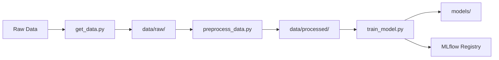

# 🏠 MLOps Assignment 1 — California Housing Price Prediction

This repository contains a complete MLOps pipeline for predicting California housing prices using the `California Housing` dataset.

---

## 📌 Objective

Build a complete MLOps pipeline for predicting California housing prices as part of **MTech AI & ML - Semester 3 MLOps Assignment**. 

Implement a reproducible and trackable machine learning workflow using:
- **DVC** for data and code versioning
- **MLflow** for experiment tracking and model registry
- **Git** for source control
- **Docker** for containerization
- **GitHub Actions** for CI/CD
- **Logging & Monitoring** for production readiness

---

## 🏠 Dataset Information

**California Housing Dataset** from scikit-learn:
- **Samples**: 20,640 housing districts
- **Features**: 8 numeric features (MedInc, HouseAge, AveRooms, etc.)
- **Target**: Median house value (in hundreds of thousands of dollars)
- **Task**: Regression problem
- **Source**: 1990 California census data

---

## 💻 Prerequisites

- **Python**: 3.8+ recommended
- **Git**: For version control
- **DVC**: For data versioning
- **MLflow**: For experiment tracking
- **Operating System**: macOS, Linux, or Windows

---

## 📂 Project Structure

```
.
├── data/
│   ├── raw/                           # Raw dataset (DVC managed)
│   └── processed/                     # Processed dataset (DVC managed)
├── src/
│   ├── get_data.py                    # Data fetching script
│   ├── preprocess_data.py             # Data preprocessing script
│   └── train_model.py                 # Training script with MLflow tracking
├── models/                            # Trained models (DVC managed)
├── dvc.yaml                           # DVC pipeline config
├── dvc.lock                           # DVC pipeline lock file
├── requirements.txt                   # Python dependencies
├── .gitignore                         # Git ignore rules
├── .dvcignore                         # DVC ignore rules
└── README.md                          # This file
```

---

## 🔧 Setup Instructions

### 1. Create and activate a virtual environment

```bash
python -m venv venv
source venv/bin/activate  # On Windows: venv\Scripts\activate
```

### 2. Install dependencies

```bash
pip install -r requirements.txt
```

### 3. Reproduce data and training pipeline

```bash
dvc repro
```

This will run the complete pipeline:
1. **get_data**: Download California Housing dataset
2. **preprocess**: Clean and transform the data  
3. **train**: Train models and save artifacts

### 4. Run training manually

```bash
python src/train_model.py
```

This will:
- Train **Linear Regression** and **Decision Tree** models.
- Track metrics (RMSE, R²) in **MLflow**.
- Register both models in the MLflow **Model Registry**.

---

## 📊 Experiment Tracking

Run the following to launch MLflow UI:

```bash
mlflow ui
```

Then open [http://localhost:5000](http://localhost:5000) to view experiments and models.

---

## 📈 Model Performance

| Model | RMSE | R² Score | Status |
|-------|------|----------|---------|
| **Decision Tree** | **70,528.80** | **0.62** | ✅ Best Model |
| Linear Regression | 74,558.14 | 0.58 | ✅ Baseline |

> **Winner**: Decision Tree Regressor selected as the best model based on lowest RMSE and highest R² score.

### Model Interpretability
- **Linear Regression**: High interpretability, good baseline
- **Decision Tree**: Non-linear patterns, feature interactions

---

## 🛠️ Technology Stack

| Component | Technology | Purpose |
|-----------|------------|---------|
| **Version Control** | Git + GitHub | Code versioning & collaboration |
| **Data Versioning** | DVC | Dataset & model versioning |
| **ML Tracking** | MLflow | Experiment tracking & model registry |
| **ML Framework** | scikit-learn | Model training & evaluation |
| **Data Processing** | pandas, numpy | Data manipulation |
| **Environment** | Python venv | Dependency isolation |

---

## 🔄 Pipeline Workflow



1. **Data Ingestion**: Fetch California Housing dataset
2. **Preprocessing**: Clean data, handle missing values, transform features
3. **Model Training**: Train multiple models with MLflow tracking
4. **Model Selection**: Automatically select best performing model
5. **Model Registry**: Register models in MLflow for deployment

---

## ✅ Completed Milestones

### ✅ Part 1: Repository and Data Versioning
- [x] Raw data versioned with **DVC** 
- [x] Processed data versioned with **DVC**
- [x] Model artifacts versioned with **DVC**
- [x] Project code versioned with **Git**
- [x] Complete DVC pipeline with 3 stages

### ✅ Part 2: Model Development & Experiment Tracking
- [x] Trained 2 models (Linear Regression & Decision Tree)
- [x] Metrics tracked in **MLflow** (RMSE, R²)
- [x] Both models registered in Model Registry
- [x] Best model auto-selection (Decision Tree: RMSE 70,528.80, R² 0.62)

---

## 📌 Upcoming (Part 3+)
- Model packaging with Flask/FastAPI
- Docker containerization
- CI/CD with GitHub Actions
- Logging & Monitoring

---

## 🔧 Troubleshooting

### Common Issues

**1. DVC Pipeline Fails**
```bash
# Clear DVC cache and retry
dvc cache dir
rm -rf .dvc/cache
dvc repro --force
```

**2. MLflow UI Not Accessible**
```bash
# Check if MLflow is running on correct port
mlflow ui --host 0.0.0.0 --port 5000
```

**3. Virtual Environment Issues**
```bash
# Recreate virtual environment
rm -rf venv
python -m venv venv
source venv/bin/activate
pip install -r requirements.txt
```

**4. Permission Errors (macOS/Linux)**
```bash
# Fix file permissions
chmod +x src/*.py
```

---

## 🤝 Contributing

1. Fork the repository
2. Create a feature branch (`git checkout -b feature/improvement`)
3. Make changes and commit (`git commit -am 'Add improvement'`)
4. Push to branch (`git push origin feature/improvement`)
5. Create Pull Request

### Development Guidelines
- Follow PEP 8 style guidelines
- Add docstrings to functions
- Update README for new features
- Test changes with `dvc repro`

---

## 👨‍💻 Authors

**Gowtham Raj R.** | **Shipra Sahu**

---

## 📞 Support

For questions regarding this assignment implementation:
- Review MLflow experiments at `http://localhost:5000`
- Check DVC pipeline status with `dvc status`
- Validate setup with `dvc repro`

---