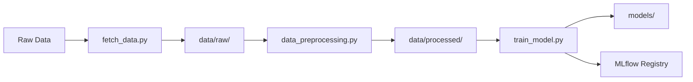

# 🏠 MLOps Assignment 1 — California Housing Price Prediction

This repository contains a complete MLOps pipeline for predicting California housing prices using the `California Housing` dataset.

---

## 📌 Objective

Build a complete MLOps pipeline for predicting California housing prices as part of **MTech AI & ML - Semester 3 MLOps Assignment**. 

Implement a reproducible and trackable machine learning workflow using:
- **DVC** for data and code versioning
- **MLflow** for experiment tracking and model registry
- **Git** for source control
- **Docker** for containerization
- **GitHub Actions** for CI/CD
- **Logging & Monitoring** for production readiness

---

## 🏠 Dataset Information

**California Housing Dataset** from scikit-learn:
- **Samples**: 20,640 housing districts
- **Features**: 8 numeric features (MedInc, HouseAge, AveRooms, etc.)
- **Target**: Median house value (in hundreds of thousands of dollars)
- **Task**: Regression problem
- **Source**: 1990 California census data

---

## 💻 Prerequisites

- **Python**: 3.8+ recommended
- **Git**: For version control
- **DVC**: For data versioning
- **MLflow**: For experiment tracking
- **Operating System**: macOS, Linux, or Windows

---

## 📂 Project Structure

```
.
├── data/
│   ├── raw/                           # Raw dataset (DVC managed)
│   └── processed/                     # Processed dataset (DVC managed)
├── src/
│   ├── fetch_data.py                  # Data fetching script
│   ├── data_preprocessing.py          # Data preprocessing script
│   ├── train_model.py                 # Training script with MLflow tracking
│   ├── api.py                         # FastAPI prediction service (main API)
│   ├── schemas.py                     # Pydantic request/response models
│   ├── models.py                      # ML model operations & utilities
│   ├── config.py                      # Configuration & logging setup
│   ├── database.py                    # Database operations & SQLite management
│   └── metrics.py                     # Metrics tracking & performance monitoring
├── models/                            # Trained models (DVC managed)
├── logs/                              # Application logs & monitoring data
│   ├── api_requests.log               # API request/response logs
│   └── predictions.db                 # SQLite database for prediction history
├── dvc.yaml                           # DVC pipeline config
├── dvc.lock                           # DVC pipeline lock file
├── requirements.txt                   # Python dependencies
├── Dockerfile                         # Docker containerization config
├── .dockerignore                      # Docker ignore rules
├── run_api.sh                         # Script to run API locally
├── .gitignore                         # Git ignore rules
├── .dvcignore                         # DVC ignore rules
└── README.md                          # This file
```

---

## 🛠️ Technology Stack

| Component | Technology | Purpose |
|-----------|------------|---------|
| **Version Control** | Git + GitHub | Code versioning & collaboration |
| **Data Versioning** | DVC | Dataset & model versioning |
| **ML Tracking** | MLflow | Experiment tracking & model registry |
| **ML Framework** | scikit-learn | Model training & evaluation |
| **Data Processing** | pandas, numpy | Data manipulation |
| **API Framework** | FastAPI | RESTful prediction service |
| **API Server** | uvicorn | ASGI web server |
| **Containerization** | Docker | Application packaging |
| **Input Validation** | pydantic | API request/response validation |
| **Database** | SQLite | Prediction logging & metrics storage |
| **Monitoring** | Custom metrics | Performance & usage tracking |
| **Environment** | Python venv | Dependency isolation |

---

## 🔧 Setup Instructions

### 1. Create and activate a virtual environment

```bash
python -m venv venv
source venv/bin/activate  # On Windows: venv\Scripts\activate
```

### 2. Install dependencies

```bash
pip install -r requirements.txt
```

### 3. Reproduce data and training pipeline

```bash
dvc repro
```

This will run the complete pipeline:
1. **fetch_data**: Download California Housing dataset
2. **preprocess**: Clean and transform the data  
3. **train**: Train models and save artifacts

### 4. Run training manually

```bash
python src/train_model.py
```

This will:
- Train **Linear Regression** and **Decision Tree** models.
- Track metrics (RMSE, R²) in **MLflow**.
- Register both models in the MLflow **Model Registry**.

---

## 📊 Experiment Tracking

Run the following to launch MLflow UI:

```bash
mlflow ui
```

Then open [http://localhost:5000](http://localhost:5000) to view experiments and models.

---

## 📈 Model Performance

| Model | RMSE | R² Score | Status |
|-------|------|----------|---------|
| **Decision Tree** | **70,528.80** | **0.62** | ✅ Best Model |
| Linear Regression | 74,558.14 | 0.58 | ✅ Baseline |

> **Winner**: Decision Tree Regressor selected as the best model based on lowest RMSE and highest R² score.

### Model Interpretability
- **Linear Regression**: High interpretability, good baseline
- **Decision Tree**: Non-linear patterns, feature interactions

---

## 🔄 Pipeline Workflow



1. **Data Ingestion**: Fetch California Housing dataset
2. **Preprocessing**: Clean data, handle missing values, transform features
3. **Model Training**: Train multiple models with MLflow tracking
4. **Model Selection**: Automatically select best performing model
5. **Model Registry**: Register models in MLflow for deployment

---

## API Endpoints

| Endpoint | Method | Description |
|----------|---------|-------------|
| `/` | GET | API information and available endpoints |
| `/health` | GET | Health check and model status |
| `/predict` | POST | Single housing price prediction |
| `/predict/batch` | POST | Batch predictions (up to 1000 samples) |
| `/metrics` | GET | API usage statistics and performance metrics |
| `/docs` | GET | Interactive API documentation (Swagger UI) |

### Quick Start API

#### 1. Run locally with script
```bash
./run_api.sh
```

#### 2. Run with Python directly
```bash
# Activate virtual environment
source venv/bin/activate

# Install dependencies
pip install -r requirements.txt

# Start the API server
cd src && python api.py
```

#### 3. Run with Docker
##### a) Pull pre-built image from Docker Hub (recommended)

Replace `<your-dockerhub-username>` and `<image-name>:<tag>` with the actual image name and tag if available.

```bash
docker pull <your-dockerhub-username>/california-housing-api:latest
docker run -p 8000:8000 <your-dockerhub-username>/california-housing-api:latest
```

##### b) Build and run locally (if you want to use your own build)

```bash
# Build Docker image
docker build -t california-housing-api .

# Run container
docker run -p 8000:8000 california-housing-api
```

### 🌐 Accessing API Endpoints

Once your API is running (using any method above), you can access the endpoints at:

**Base URL**: `http://localhost:8000`

#### 1. **Interactive Documentation** (Recommended)
Visit: `http://localhost:8000/docs`
- Complete API documentation with interactive testing
- Try all endpoints directly from your browser
- See request/response schemas and examples

#### 2. **API Information**
Visit: `http://localhost:8000/` 
- Basic API information and available endpoints
- Quick overview of the service

#### 3. **Health Check**
Visit: `http://localhost:8000/health`
- Check if the API and model are loaded correctly
- Monitor service status

#### 4. **Metrics & Monitoring**
Visit: `http://localhost:8000/metrics`
- API usage statistics and performance metrics
- Request counts, response times, error rates
- Recent prediction history and database stats
- Model performance tracking

#### 5. **Make Predictions**
**Endpoints**: 
- Single: `POST http://localhost:8000/predict`
- Batch: `POST http://localhost:8000/predict/batch`

**Required Headers**: `Content-Type: application/json`

**Input Features** (all required with validation ranges):
- `MedInc`: Median income in block group (0.5 - 15.0)
- `HouseAge`: Median house age in block group (1 - 52 years)  
- `AveRooms`: Average rooms per household (2.0 - 15.0)
- `AveBedrms`: Average bedrooms per household (0.1 - 5.0)
- `Population`: Block group population (3 - 40,000)
- `AveOccup`: Average occupancy per household (1.0 - 50.0)
- `Latitude`: Geographic latitude (32.5 - 41.95)
- `Longitude`: Geographic longitude (-124.35 to -114.13)

### Testing the API
```bash
# Test single prediction
curl -X POST "http://localhost:8000/predict" \
-H "Content-Type: application/json" \
-d '{"MedInc": 8.33, "HouseAge": 41.0, "AveRooms": 6.98, "AveBedrms": 1.02, "Population": 322.0, "AveOccup": 2.56, "Latitude": 37.88, "Longitude": -122.23}'

# Test batch prediction
curl -X POST "http://localhost:8000/predict/batch" \
-H "Content-Type: application/json" \
-d '{
  "features": [
    {
      "MedInc": 8.33, "HouseAge": 41.0, "AveRooms": 6.98, "AveBedrms": 1.02, "Population": 322.0, "AveOccup": 2.56,
      "Latitude": 37.88, "Longitude": -122.23
    },
    {
      "MedInc": 7.26, "HouseAge": 52.0, "AveRooms": 8.29, "AveBedrms": 1.07, "Population": 496.0, "AveOccup": 2.80,
      "Latitude": 37.85, "Longitude": -122.24
    }
  ]
}'
```

---

## ✅ Completed Milestones

### ✅ Part 1: Repository and Data Versioning
- [x] Raw data versioned with **DVC** 
- [x] Processed data versioned with **DVC**
- [x] Model artifacts versioned with **DVC**
- [x] Project code versioned with **Git**
- [x] Complete DVC pipeline with 3 stages

### ✅ Part 2: Model Development & Experiment Tracking
- [x] Trained 2 models (Linear Regression & Decision Tree)
- [x] Metrics tracked in **MLflow** (RMSE, R²)
- [x] Both models registered in Model Registry
- [x] Best model auto-selection (Decision Tree: RMSE 70,528.80, R² 0.62)

### ✅ Part 3: API & Docker Packaging
- [x] **FastAPI** prediction service with comprehensive endpoints
- [x] **Input validation** using pydantic schemas
- [x] **Single & batch prediction** capabilities
- [x] **Docker containerization** with optimized Dockerfile
- [x] **Health checks** and logging for monitoring
- [x] **JSON input/output** with proper error handling

### ✅ Part 5: Logging and Monitoring
- [x] **Essential Logging**: File-based and SQLite database logging
- [x] **Prediction Tracking**: Complete tracking with confidence scores
- [x] **Performance Metrics**: API usage and response time tracking
- [x] **Metrics Endpoint**: `/metrics` for monitoring data
- [x] **Modular Architecture**: Clean separation of concerns
- [x] **Error Tracking**: Structured error logging
- [x] **Database Storage**: SQLite for persistent metrics storage

---

## 📌 Upcoming (Part 4+)
- CI/CD with GitHub Actions
- Automated testing pipeline
- Docker Hub integration

---

## 🔧 Troubleshooting

### Common Issues

**1. DVC Pipeline Fails**
```bash
# Clear DVC cache and retry
dvc cache dir
rm -rf .dvc/cache
dvc repro --force
```

**2. MLflow UI Not Accessible**
```bash
# Check if MLflow is running on correct port
mlflow ui --host 0.0.0.0 --port 5000
```

**3. Virtual Environment Issues**
```bash
# Recreate virtual environment
rm -rf venv
python -m venv venv
source venv/bin/activate
pip install -r requirements.txt
```

**4. Permission Errors (macOS/Linux)**
```bash
# Fix file permissions
chmod +x src/*.py
```

**5. API Port Already in Use**
```bash
# If you get "Address already in use" error on port 8000
# Find what's using port 8000
lsof -i :8000

# Kill the conflicting process (replace PID with actual process ID)
kill -9 <PID>

# Or kill all processes using port 8000
lsof -ti :8000 | xargs kill -9
```

**6. API Issues**
```bash
# Check API health
curl http://localhost:8000/health

# Or check API documentation
open http://localhost:8000/docs
```

---

## 🤝 Contributing

1. Fork the repository
2. Create a feature branch (`git checkout -b feature/improvement`)
3. Make changes and commit (`git commit -am 'Add improvement'`)
4. Push to branch (`git push origin feature/improvement`)
5. Create Pull Request

### Development Guidelines
- Follow PEP 8 style guidelines
- Add docstrings to functions
- Update README for new features
- Test changes with `dvc repro`

---

## 👨‍💻 Authors

**Gowtham Raj R.** | **Shipra Sahu**

---

## 📞 Support

For questions regarding this assignment implementation:
- Review MLflow experiments at `http://localhost:5000`
- Check DVC pipeline status with `dvc status`
- Validate setup with `dvc repro`

---